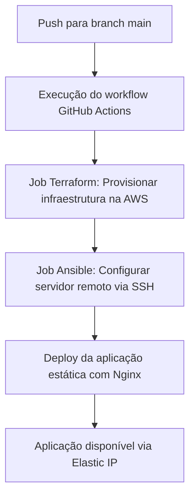

# DevOps Challenge

## Introdução

Este projeto foi desenvolvido como parte de um desafio técnico com o objetivo de demonstrar habilidades práticas em DevOps, incluindo:

- Provisionamento de infraestrutura na AWS usando **Terraform**
- Configuração automatizada com **Ansible**
- Deploy de aplicação web estática via **Nginx**
- Implementação de uma **pipeline de entrega contínua** com **GitHub Actions**
- Aplicação de boas práticas de **segurança, monitoramento e performance**

---

## Tecnologias Utilizadas

- **AWS EC2** (Ubuntu 22.04 LTS)
- **Terraform**
- **Ansible**
- **Nginx**
- **GitHub Actions**
- **Elastic IP**
- **UFW / Fail2Ban**
- **CloudWatch** (monitoramento)
- **Bash / Shell Script**

---

## Provisionamento com Terraform

- Criação de instância EC2 Ubuntu 22.04
- Associação a um **Elastic IP** para IP fixo
- Configuração de **Security Group** permitindo portas 22 (SSH) e 80 (HTTP)

### Execução:

```bash
cd terraform
terraform init
terraform apply -auto-approve
```

> O IP da instância será exibido no output do Terraform e utilizado pelo Ansible.

---

## Configuração com Ansible

O Ansible realiza as seguintes tarefas:

- Atualização do sistema
- Instalação do Nginx
- Deploy da página HTML estática
- Habilitação de UFW (firewall) com regras seguras
- Instalação do Fail2Ban para proteção contra brute force via SSH

### Execução:

```bash
cd ansible
ansible-playbook -i inventory playbook.yml
```

---

## Deploy Web

Após o provisionamento e configuração, acesse:

```
http://54.221.123.45
```

Você verá a mensagem: `Deploy realizado com sucesso!`

> Obs.: O endereço Ip esta desativado no momento.

---

## Continuous Delivery com GitHub Actions

### Pipeline automatizada:

- Executa em cada `push` na branch `main`
- Etapas:
  1. Provisiona infraestrutura via Terraform
  2. Executa o Ansible com inventário dinâmico
  3. Faz deploy da aplicação automaticamente

### Local:
`.github/workflows/deploy.yml`

### Variáveis de ambiente (GitHub Secrets):

| Variável                | Descrição                            |
|-------------------------|--------------------------------------|
| `AWS_ACCESS_KEY_ID`     | Chave de acesso IAM                  |
| `AWS_SECRET_ACCESS_KEY` | Chave secreta IAM                    |
| `AWS_REGION`            | Região AWS                           |
| `TF_VAR_key_name`       | Nome da chave SSH (.pem) na AWS      |
| `PRIVATE_KEY`           | Conteúdo da chave SSH `.pem`         |
| `ANSIBLE_HOST`          | IP público fixo (Elastic IP)         |

#### Diagrama de fluxo da pipeline



---

### Como Usar

1. Configure os **Secrets** no repositório GitHub
2. Faça `push` na branch `main`
3. O pipeline executará provisionamento e deploy automaticamente
4. Acesse a aplicação via Elastic IP no navegador

---

 ### Ferramentas e Técnicas Usadas na Pipeline

#### GitHub Actions

* **Função:** Automatizar o fluxo de deploy
* **Motivo da escolha:** Integração nativa com GitHub e suporte a secrets

#### Terraform

* **Função:** Provisionar a infraestrutura na AWS
* **Motivo da escolha:** Infraestrutura versionável e amplamente usada

#### Ansible

* **Função:** Configurar o servidor automaticamente
* **Motivo da escolha:** Simples, idempotente e fácil de manter

#### Secrets do GitHub

* **Função:** Armazenar credenciais com segurança
* **Secrets usados:** `AWS_ACCESS_KEY_ID`, `AWS_SECRET_ACCESS_KEY`, `AWS_REGION` `TF_VAR_key_name`, `PRIVATE_KEY`, `ANSIBLE_HOST`

---

### Objetivo da Pipeline

Padronizar e automatizar o deploy completo da aplicação de forma segura e reprodutível, garantindo:

* Escalabilidade
* Segurança com uso de chaves e firewall
* Facilidade de manutenção e entrega contínua

---

## Boas Práticas de Segurança Aplicadas

- **Firewall UFW** com regras explícitas
- **Fail2Ban** configurado para proteger o SSH
- **Acesso via chave SSH** (sem senha)
- **Atualizações automáticas do sistema**
- **Logs configurados para monitoramento via CloudWatch**

---

## Desafios Encontrados e Soluções

### Problema: IP da EC2 mudando a cada `terraform apply`
- **Solução:** Uso de Elastic IP para manter IP fixo e permitir deploy automático com Ansible

### Problema: Erro de permissão na chave SSH
- **Solução:** Garantir `chmod 400` e correto uso da chave via secrets no GitHub

### Problema: Ansible falhando ao conectar
- **Solução:** Adição dinâmica do IP no `inventory` gerado automaticamente pelo workflow

---

>  This is a challenge by **[Coodesh](https://coodesh.com/)**
